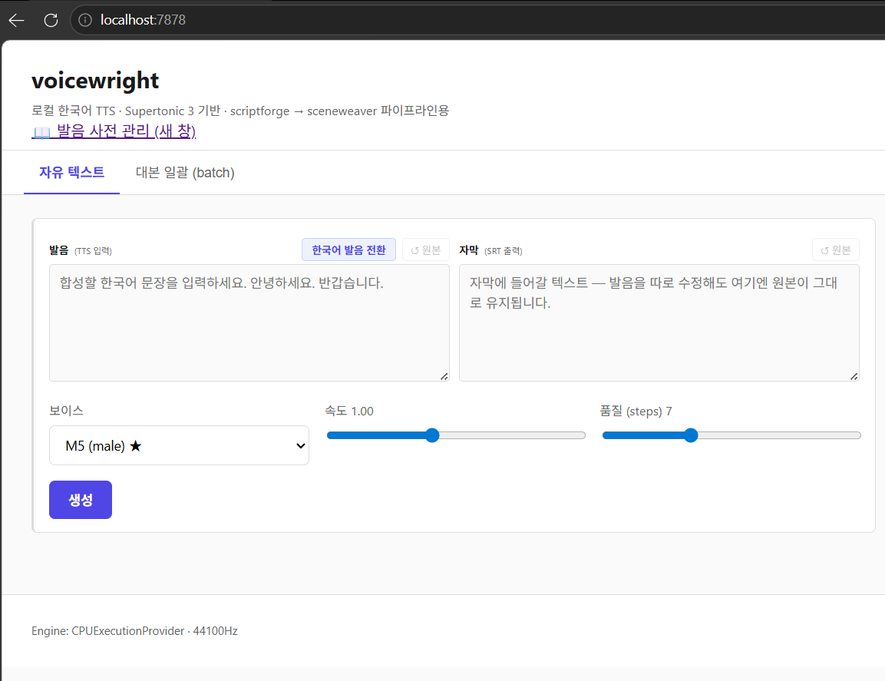
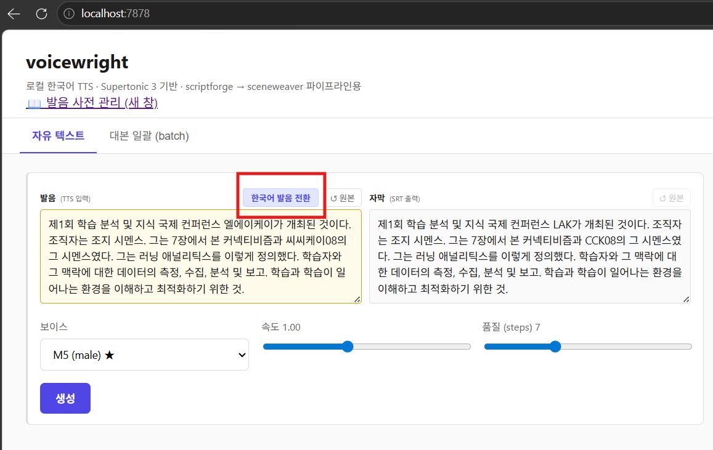
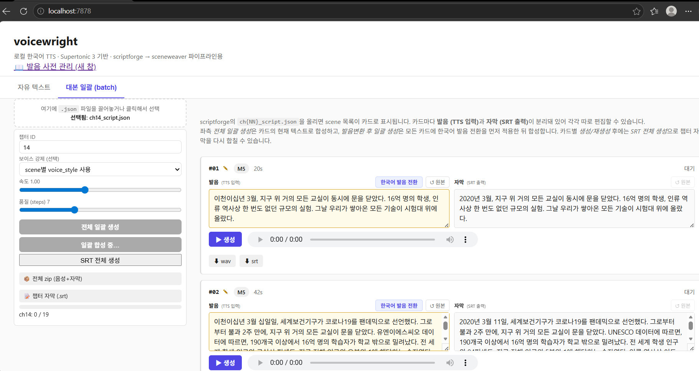
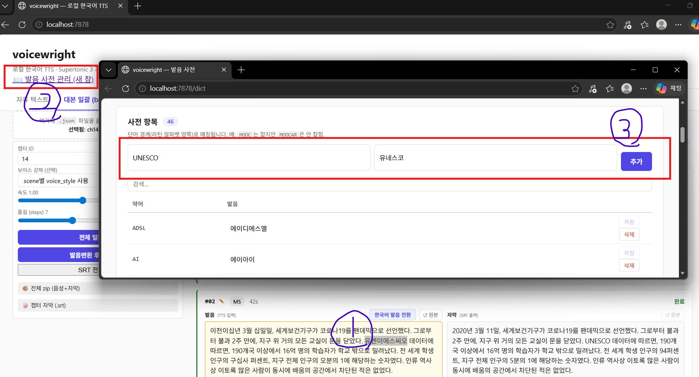

# voicewright

> 로컬에서 도는 한국어 TTS 웹앱. **Supertone Supertonic 3** 기반.
> 대본·음성이 외부 서버로 나가지 않습니다.

---

## 1. 빠른 설치

### ① 폴더 받기

레포를 클론하거나 ZIP으로 받아서 원하는 위치에 풀어둡니다.
```
git clone https://github.com/leedonwoo2827-ship-it/voicewright.git
```
→ 받은 위치에 **`voicewright`** 폴더가 생깁니다.

### ② voicewright 폴더 **안에서** cmd 열기

탐색기로 `voicewright` 폴더 안까지 들어간 뒤(주소창에 `\voicewright`가 보여야 함) **주소창에 `cmd` 입력 → Enter**.
(또는 폴더 빈 곳에서 Shift + 우클릭 → "터미널에서 열기".)

> ⚠️ 한 단계 위 폴더에서 열면 `install.bat / start.bat`을 못 찾습니다 (`파일 .bat을(를) 찾을 수 없습니다` 에러). 프롬프트가 `...\voicewright>` 로 끝나는지 확인하세요.

<!-- 이미지: 탐색기 주소창에 cmd 입력하는 모습 -->


### ③ 한 줄 실행

```
install.bat
```

가상환경 생성 → GPU 자동 감지 → 의존성 설치 → 모델 다운로드(~250MB) → 환경 점검까지 자동. 5~10분 소요.

> **사전 요구**: [Python 3.11~3.13](https://python.org) · [git](https://git-scm.com) · [git-lfs](https://git-lfs.com)
> 없으면 `install.bat`이 알려줍니다.

<!-- 이미지: install.bat 실행 후 마지막 doctor 출력 -->


---

## 2. 실행

설치 때와 **같은 위치(`voicewright` 폴더 안)** 에서 실행해야 합니다.

cmd에서:

```
cd D:\경로\voicewright
start.bat
```

또는 탐색기로 `voicewright` 폴더 들어가서 `start.bat` 더블클릭.

> 프롬프트가 `D:\...\voicewright>` 로 끝나는 상태여야 합니다. 한 단계 위에서 치면 `파일 .bat을(를) 찾을 수 없습니다` 에러가 납니다.

브라우저로 `http://localhost:7878` 접속.

<!-- 이미지: 웹 UI 첫 화면 -->


---

## 3. 사용법

### 자유 텍스트 합성

문장을 입력하고 **생성** → wav와 자막(srt)이 함께 나옵니다.
약어·숫자·연도가 들어있으면 **한국어 발음 전환** 버튼으로 발음 박스만 자연스러운 한국어로 바꿔주세요. 자막 박스는 원본 그대로 유지됩니다.

<!-- 이미지: 자유 텍스트 탭 사용 흐름 (입력 → 발음 전환 → 생성) -->


### 대본 일괄 합성

scriptforge가 만든 `ch{NN}_script.json`을 끌어다 놓으면 scene별 카드로 표시됩니다.
**발음변환 후 일괄 생성**을 누르면 모든 카드의 발음을 한 번에 자연스럽게 바꾼 뒤 합성합니다.

<!-- 이미지: 배치 탭 카드 + 일괄 생성 결과 -->


### 발음 사전 편집

상단 **📖 발음 사전 관리** 클릭 → `/dict` 페이지에서 약어·발음을 추가/수정/삭제. 저장 즉시 다음 합성부터 반영됩니다(서버 재시작 X).

<!-- 이미지: /dict 사전 편집 페이지 -->


---

## 더 자세히

| 문서 | 내용 |
|---|---|
| [docs/install.md](docs/install.md) | 수동 설치, 환경변수, 문제 해결 |
| [docs/usage.md](docs/usage.md) | CLI 명령, 발음 사전 동작, 보이스 매핑, 파이프라인 위치 |

라이선스: 본체 MIT · 모델 가중치 OpenRAIL-M ([LICENSE-THIRD-PARTY.md](LICENSE-THIRD-PARTY.md))
